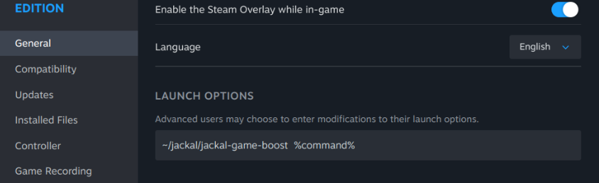

<h1 align="center">
  <a href="https://github.com/jtmb">
    
  </a>
</h1>

<div align="center">
  <b>Jackal – Game Boost</b> - Jackal is a lightweight Linux game booster designed to temporarily optimize your system for gaming sessions on a per-game basis.
  <br />
  <br />
  <a href="https://github.com/jtmb/jackal/issues/new?assignees=&labels=bug&title=bug%3A+">Report a Bug</a>
</div>
<br>

<details open="open">
<summary>Table of Contents</summary>

- [Prerequisites](#prerequisites)
- [Getting Started](#getting-started)
- [Configuring Jackal](#configuring-jackal)
- [Contributing](#contributing)
- [License](#license)

</details>
<br>

---

## Prerequisites

- **Linux with Wayland Plasma session**

- <strong>Passwordless <code>systemctl</code> for service management (optional):</strong><br>
  If you want Jackal to stop/start background services, your user (the same user Steam runs as) must be able to run certain <code>systemctl</code> commands without a password. Add the following line to your <code>sudoers</code> file:

  ```text
  yourusername ALL=(ALL) NOPASSWD: /bin/systemctl stop *, /bin/systemctl start *, /bin/systemctl kill *
  ```
  <sub>Replace <code>yourusername</code> with your actual Linux username.</sub>

  > ⚠️ **Note:** This is only required if you are using jackal to start/stop services in your Jackal config.


## How does Jackal work?

Jackal is a lightweight Linux game booster designed to temporarily optimize your system for gaming sessions. It works by interacting directly with the display server (Wayland) and system services to give your games the maximum possible performance while they are running.

### Key mechanics:

- **VRR (Variable Refresh Rate) and HDR management**  
  Jackal can disable VRR and HDR for the duration of your game. This is useful on certain monitors or setups where dynamic refresh or HDR can interfere with smooth performance. By temporarily adjusting these display settings via `kscreen-doctor`, Jackal ensures the game has consistent output timing on Wayland, without permanently altering your system configuration.

- **Service management**  
  Jackal can stop background services (like Docker or other specified daemons) that might consume CPU, GPU, or I/O resources during gameplay. These services are tracked and restored automatically once the game exits, ensuring no permanent disruption to your system.

- **Foreground process tracking**  
  Jackal launches your game as a foreground process and monitors it. When the game exits, cleanup routines restore VRR, HDR, and any previously stopped services. This ensures that the optimizations only apply while your game is running.

- **Wayland integration**  
  Jackal works on Wayland by directly interacting with the compositor layer via `kscreen-doctor`. It modifies output settings in a way that applies to the same session as your game, without requiring X11 or root-level access to the display server. This allows Jackal to make real-time adjustments while staying lightweight and non-intrusive.

- **User-level execution and anti-cheat safety**  
  Jackal runs entirely at the user level and never injects or modifies game code. It does not interact with the game’s memory, the kernel, or any anti-cheat layers, making it perfectly safe to use with games that include cheat protection systems.


## Getting Started
### Using Jackal with Steam Launch Options

To run Jackal automatically when launching a game from Steam, set the game's **Launch Options** to:

<div align="center">
  
  <br>
  <sub><i>Example: Setting Jackal in Steam Launch Options</i></sub>
</div>

```
path/to/jackal-game-boost %command%
```

**Example:** If Jackal is located in your home directory under `~/jackal`, use:

```
~/jackal/jackal-game-boost %command%
```

You can also combine Jackal with other launch options **before** the `%command%` argument. For example:

```
MANGOHUD=0 gamemoderun ~/jackal/jackal-game-boost %command%
```

This will run MangoHud and GameMode together with Jackal before launching your game.

Jackal will automatically:

- Disable VRR/HDR if configured.
- Stop background services specified in the config.
- Restore everything after the game exits.

---

## Configuring Jackal

Jackal uses a shell-based configuration file:

```bash
CONFIG_FILE="~/jackal/jackal-config"
```

Example `jackal-config`:

```bash
# Display output to manage (kscreen-doctor)
OUTPUT=2

# Disable VRR/HDR in-game? (true/false)
VRR_ENABLED=false
HDR_ENABLED=false

# Services to stop during gameplay
SERVICES_TO_MANAGE=(
    "docker"
    "pulseaudio"
)
```

> The script sources this file automatically. Change values as needed.


## Troubleshooting

If services fail to stop, make sure:

1. Your `sudoers` file allows passwordless execution of systemctl files as your user (the default user steam runs on):

```text
$USER ALL=(ALL) NOPASSWD: /bin/systemctl stop *, /bin/systemctl start *, /bin/systemctl kill *
```

2. Commands run with `sudo -n` inside the script, so it does not prompt for a password.
3. `kscreen-doctor` commands work correctly from your user session.

Check the log output to confirm:

```shell
cat ~/jackal.log
```

---

## Contributing

Contributions are welcome! When reporting issues or submitting PRs, please:

- _Be Reproducible_: Provide clear steps to reproduce.
- _Be Specific_: Include OS, session type (Wayland/X11), and Jackal version.
- _Be Scoped_: One bug/feature per report.

---

## License

This project is licensed under the **GNU GENERAL PUBLIC LICENSE v3**.  

See [LICENSE](LICENSE) for details.

